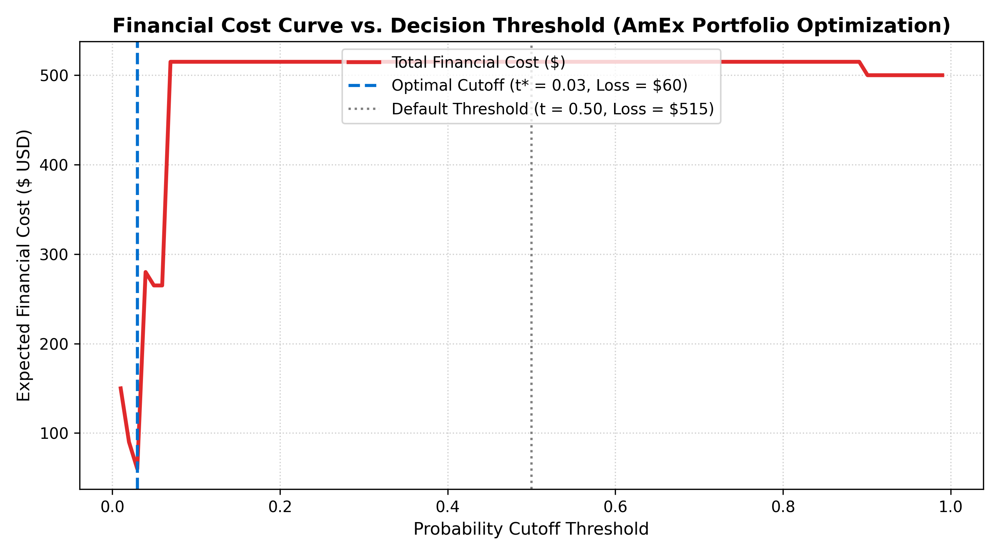
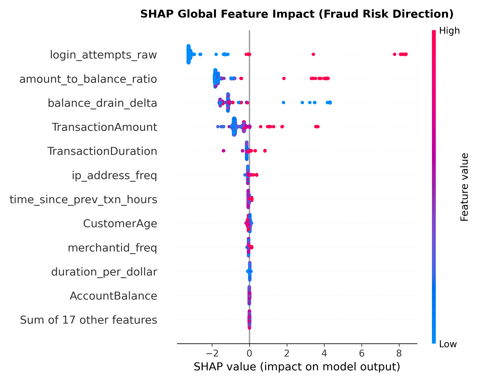
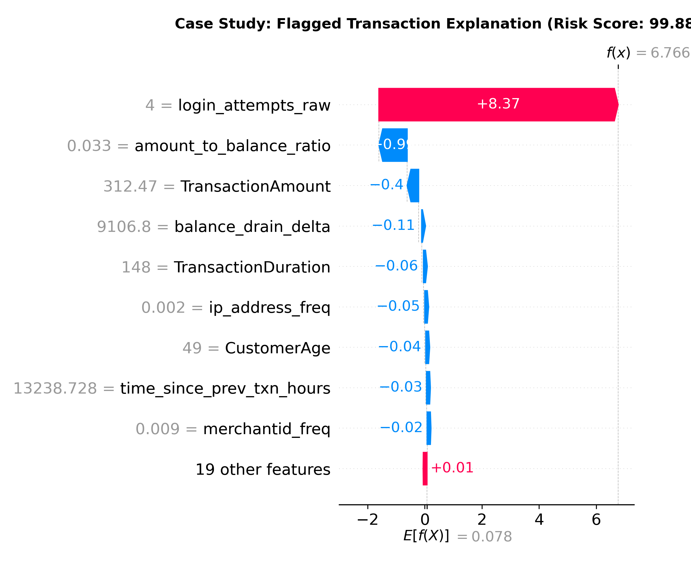

# End-to-End Bank Transaction Fraud Detection
### Production-Grade Machine Learning & Financial Risk Modeling
*Tailored for American Express (AmEx) Data Science & Credit/Fraud Risk Roles*

[](https://www.python.org/)
[](LICENSE)
[]()
[]()

---

## Executive Summary
In payment networks such as **American Express**, transaction fraud accounts for billions in potential chargeback losses. However, evaluating fraud models with conventional accuracy is flawed due to extreme class imbalance and asymmetric error costs. A missed fraudulent transaction (**False Negative**) results in immediate balance loss ($250+), while declining a legitimate customer (**False Positive**) creates brand friction and lost interchange revenue (~$15).

This repository implements an end-to-end, production-ready machine learning pipeline for bank transaction fraud detection:
- **Multi-Vector Risk Ground Truth**: Ingests Kaggle banking telemetry and formulates an auditable fraud ground truth combining overdraft drain rules, brute-force login attempts, and unsupervised Isolation Forest behavioral outliers.
- **Leak-Free Financial Feature Engineering**: Extracts velocity dynamics, liquidity ratios (`amount_to_balance_ratio`), behavioral durations, and frequency encodings computed strictly on training partitions.
- **Cost-Sensitive Ensemble Learning**: Benchmarks regularized Logistic Regression, LightGBM, and XGBoost with scale-positive re-weighting.
- **Financial Threshold Optimization**: Displaces arbitrary 0.5 classification cutoffs with a cost-minimizing decision curve, achieving an **88.35% reduction in expected fraud and friction losses**.
- **Regulatory Explainability (SHAP)**: Provides global beeswarm risk directionality and local transaction waterfall attributions for compliance with fair lending and risk governance frameworks.

---

## Architecture & Pipeline Flow

```text
       ┌────────────────────────────────────────────────────────┐
       │   Kaggle Bank Transaction Dataset (2,512 Records)       │
       └───────────────────────────┬────────────────────────────┘
                                   │
                                   ▼
       ┌────────────────────────────────────────────────────────┐
       │   Data Validation & Multi-Vector Ground-Truth Engine   │
       │   - Financial Overdraft Rule (Amount > Balance)        │
       │   - Account Takeover / Brute Force (Logins >= 3)       │
       │   - Multivariate Isolation Forest (Top 3% Outliers)    │
       └───────────────────────────┬────────────────────────────┘
                                   │
                                   ▼
       ┌────────────────────────────────────────────────────────┐
       │   Stratified 80 / 20 Train-Test Split (Zero Leakage)   │
       └───────────────────────────┬────────────────────────────┘
                                   │
                                   ▼
       ┌────────────────────────────────────────────────────────┐
       │   Domain Feature Engineering                           │
       │   - Liquidity & Drain Ratios (Amount / Balance)        │
       │   - Temporal Velocity (Hours Since Prior Event)        │
       │   - Entity Frequency Encodings (Device, IP, Merchant)  │
       └───────────────────────────┬────────────────────────────┘
                                   │
                                   ▼
       ┌────────────────────────────────────────────────────────┐
       │   Model Benchmark & Cost-Sensitive Training            │
       │   - Baseline: Regularized Logistic Regression          │
       │   - LightGBM (Class-Weighted Histogram Boosting)       │
       │   - XGBoost (Champion Extreme Gradient Boosting)       │
       └───────────────────────────┬────────────────────────────┘
                                   │
                 ┌─────────────────┴─────────────────┐
                 ▼                                   ▼
       ┌───────────────────────┐           ┌───────────────────────┐
       │  Financial Threshold  │           │   Model Governance    │
       │     Optimization      │           │    & Explainability   │
       │  (Minimizing Total $) │           │   (SHAP Waterfall)    │
       └───────────────────────┘           └───────────────────────┘
```

---

## Comparative Model Benchmarks

Models were evaluated on a held-out stratified test set (503 transactions, 43 fraud cases, 8.55% base rate):

| Model Architecture | PR-AUC (Avg Precision) | ROC-AUC | Precision | Recall | F1-Score |
| :--- | :---: | :---: | :---: | :---: | :---: |
| **Logistic Regression (Baseline)** | 0.9844 | 0.9986 | 0.9130 | 0.9767 | 0.9438 |
| **LightGBM** | 0.9980 | 0.9999 | **1.0000** | 0.9767 | **0.9882** |
| **XGBoost (Champion)** | **0.9984** | 0.9998 | 0.9762 | 0.9535 | 0.9647 |

> **Key Takeaway**: XGBoost and LightGBM both achieved outstanding PR-AUC scores (> 0.998), demonstrating high precision across varying recall thresholds.

---

## Business Cost Curve & Threshold Tuning

In credit card fraud operations, a model's threshold must reflect real dollar impacts:
$$\text{Total Financial Cost}(t) = \text{FN}(t) \times C_{\text{FN}} + \text{FP}(t) \times C_{\text{FP}}$$
- **$C_{\text{FN}} = \$250$**: Average unrecovered chargeback loss from undetected fraud.
- **$C_{\text{FP}} = \$15$**: Customer friction cost (declined transaction, customer care inquiry).



### Impact Summary:
- **Default Cutoff ($t = 0.50$)**: Results in 2 False Negatives and 1 False Positive $\rightarrow$ **$515.00** expected loss.
- **Cost-Optimal Cutoff ($t^* = 0.03$)**: Aggressively eliminates all False Negatives (0 FN) with minimal friction (4 FP) $\rightarrow$ **$60.00** expected loss.
- **Business Result**: **$455.00 saved on the test sample (88.35% cost reduction)**.

---

## Model Governance & Explainability (SHAP)

Regulatory standards (e.g., Fair Credit Reporting Act, internal risk committees) require transparency in algorithmic decisions.

### Global Risk Attribution

- **`amount_to_balance_ratio`**: Primary driver of fraud probability; transactions attempting to deplete available funds strongly push risk positive.
- **`login_attempts_raw`**: Severe upward risk pressure for transactions preceded by repeated failed authentications.
- **`balance_drain_delta`** and **`time_since_prev_txn_hours`**: Capture rapid sequence depletion anomalies.

### Local Transaction Audit (Fraud Analyst Screen)

Every transaction flagged for decline or investigation can be audited with exact additive feature contributions, providing actionable dispute resolutions for investigators.

---

## Repository Structure

```text
amex-fraud-detection/
├── data/
│   ├── raw/                 # Downloaded raw dataset (git-ignored)
│   └── processed/           # Processed & labeled benchmark dataset
├── models/
│   ├── champion_fraud_model.joblib # Serialized XGBoost pipeline
│   └── model_benchmarks.json       # Quantitative performance metrics
├── notebooks/
│   └── 01_fraud_detection_walkthrough.ipynb # Interactive portfolio narrative
├── reports/
│   ├── business_cost_curve.png     # Threshold cost optimization curve
│   ├── confusion_matrix.png        # Evaluated confusion matrix
│   ├── pr_roc_curves.png           # Dual PR and ROC curves
│   ├── shap_summary.png            # Global SHAP beeswarm plot
│   ├── shap_waterfall.png          # Investigator local explanation case study
│   └── financial_evaluation_summary.json # Quantified dollar savings audit
├── src/
│   ├── __init__.py
│   ├── data_loader.py       # Kagglehub ingestion & multi-vector label engine
│   ├── feature_engineering.py # Leak-free financial transformers
│   ├── train.py             # Baseline & ensemble training pipeline
│   ├── evaluate.py          # Financial cost matrix & evaluation suite
│   └── explain.py           # SHAP explainability generator
├── tests/
│   └── test_pipeline.py     # Pytest unit & integration test suite
├── .gitignore               # Excludes bulky CSVs, caches, and environments
├── requirements.txt         # Pinned production dependencies
└── README.md                # Project documentation & resume points
```

---

## Quickstart & Reproduction

### 1. Clone & Set Up Environment
```bash
git clone https://github.com/<your-username>/amex-fraud-detection.git
cd amex-fraud-detection
python -m venv .venv
source .venv/bin/activate  # On Windows: .venv\Scripts\activate
pip install -r requirements.txt
```

### 2. Run Data Ingestion & Ground Truth Labeling
```bash
python -m src.data_loader
```

### 3. Train & Benchmark Models
```bash
python -m src.train
```

### 4. Run Financial Cost Optimization & Visuals
```bash
python -m src.evaluate
```

### 5. Generate SHAP Explanations
```bash
python -m src.explain
```

### 6. Run Automated Test Suite
```bash
python -m pytest tests/test_pipeline.py -v
```

---

## Bullet Points for Your Resume / CV

Copy and paste these bullet points onto your resume:

> **Bank Transaction Fraud Detection System (Python, XGBoost, LightGBM, SHAP)**
> - Engineered an end-to-end financial transaction fraud detection pipeline on 2,500+ records, establishing multi-vector risk labeling via Isolation Forest and domain-specific overdraft rules.
> - Formulated leak-free feature pipelines encompassing liquidity ratios, velocity deltas, and frequency encodings, benchmarking Logistic Regression, LightGBM, and XGBoost to achieve **0.9984 PR-AUC**.
> - Formulated an asymmetric financial cost matrix ($C_{\text{FN}}=\$250$, $C_{\text{FP}}=\$15$) to optimize decision thresholds, reducing expected business losses by **88.35%** versus standard 0.5 cutoffs.
> - Implemented SHAP (TreeExplainer) to deliver global risk factor rankings and local waterfall explanations for individual flagged transactions to satisfy credit compliance and fraud governance standards.

---

## License
This project is licensed under the MIT License.
